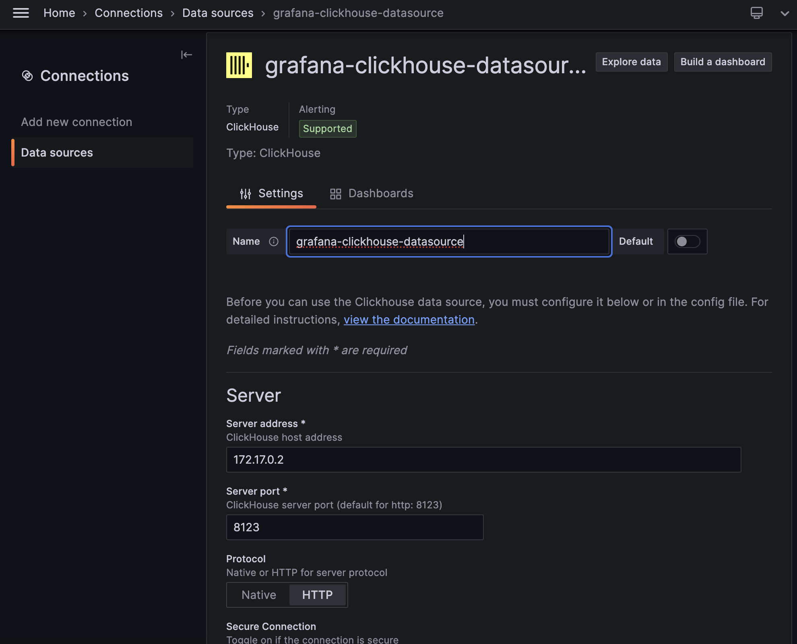

### 1) Установка зависимостей
```bash
pip install -r requirements.txt
```

### 2) Запуск Clickhouse 
#### Для работы с ClickHouse сначала установите образ Docker контейнера:
```bash
docker pull clickhouse/clickhouse-server
```

#### Запустите контейнер ClickHouse с заданными параметрами:
```bash
docker run -d --name {container-name} -p {port:port} -p 9000:9000 clickhouse/clickhouse-server
```

#### Для настройки пользователя и пароля в ClickHouse, используйте команду docker exec для входа в терминал контейнера:
```bash
docker exec -it clickhouse-server bash
```
Если вы используете Docker Desktop, просто сделайте pull нужного образа, настройте параметры и запустите его.

Проверьте подключение, открыв в браузере http://localhost:{port}/. При успешном подключении вы увидите сообщение Ok.
### 3) Запуск Grafana
#### Для запуска Grafana необходимо установить образ Docker контейнера:
```bash
docker pull grafana/grafana
```

#### Запустите контейнер Grafana с заданными параметрами:
```bash 
docker run -d --name {container-name} -p {port:port} -p 3000:3000 grafana/grafana
```

Если вы используете Docker Desktop, просто сделайте pull нужного образа, настройте параметры и запустите его.

Проверьте подключение, открыв в браузере http://localhost:{port}/. При успешном подключении вы увидите стартовую страницу Grafana.

#### Окно подключения Grafana к clickhouse выглядит так:

### 4) Запуск бота
#### Создайте нового бота с помощью @BotFather в Telegram и получите токен. Сохраните полученный токен в переменную TELEGRAM_BOT_TOKEN в файле .env.

### 5) Установите следующие переменные окружения в файле .env:
```python
TELEGRAM_BOT_TOKEN — токен Telegram бота.
BINANCE_API_KEY — ключ API Binance.
BINANCE_API_SECRET — секретный ключ API Binance.
BYBIT_API_KEY — ключ API Bybit.
BYBIT_API_SECRET — секретный ключ API Bybit.
BYBIT_API_TESTNET — тестовый ключ API Bybit.
BYBIT_API_SECRET_TESTNET — тестовый секретный ключ API Bybit.
METAMASK_PKEY — приватный ключ MetaMask.
CLICKHOUSE_LOGIN — логин ClickHouse.
CLICKHOUSE_PASSWORD — пароль ClickHouse.
CLICKHOUSE_PORT — порт ClickHouse.
```

### Запуск бота:
```python
python main.py
```


### Логи сохраняются [здесь](./logs)